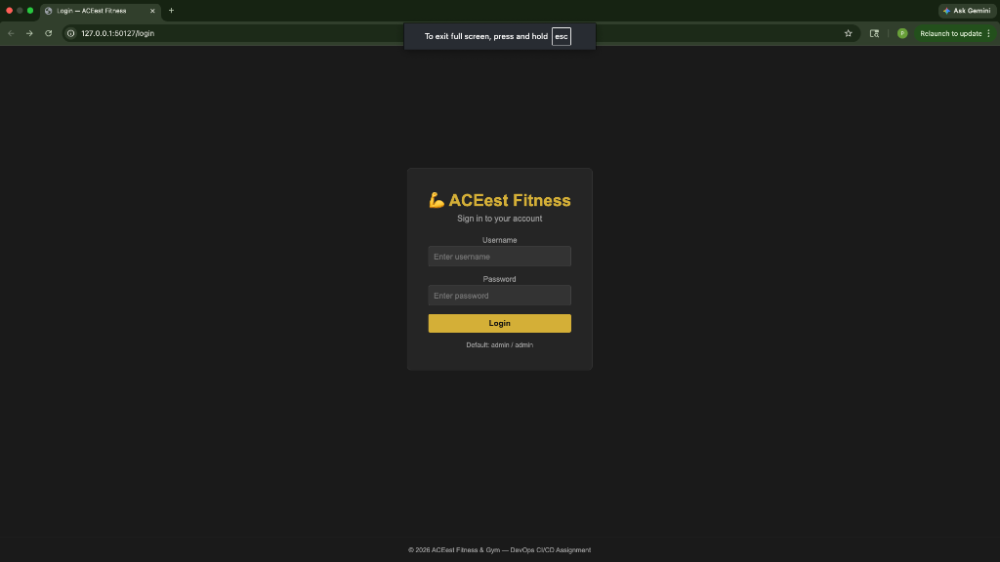
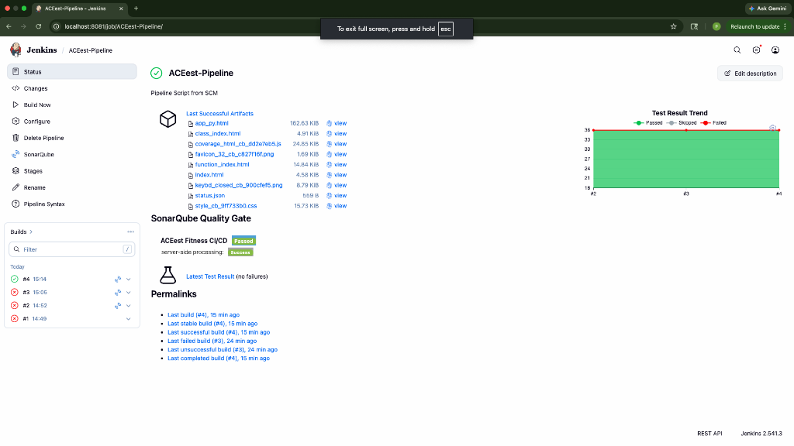
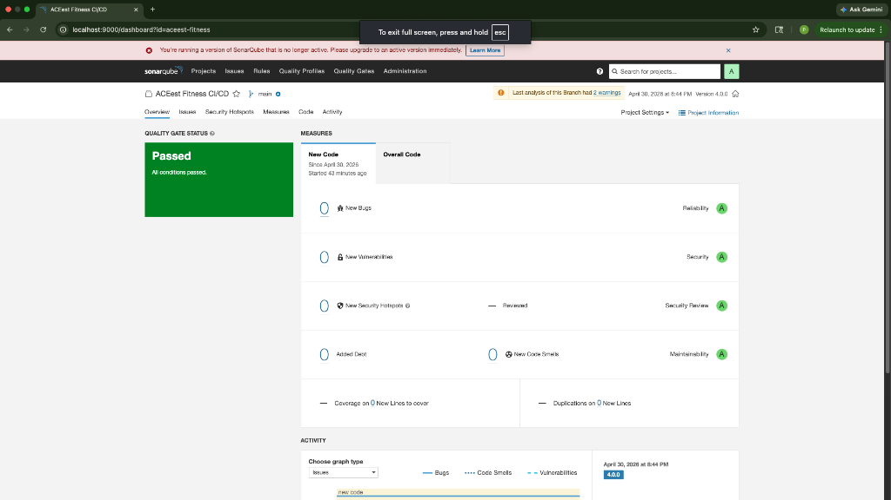
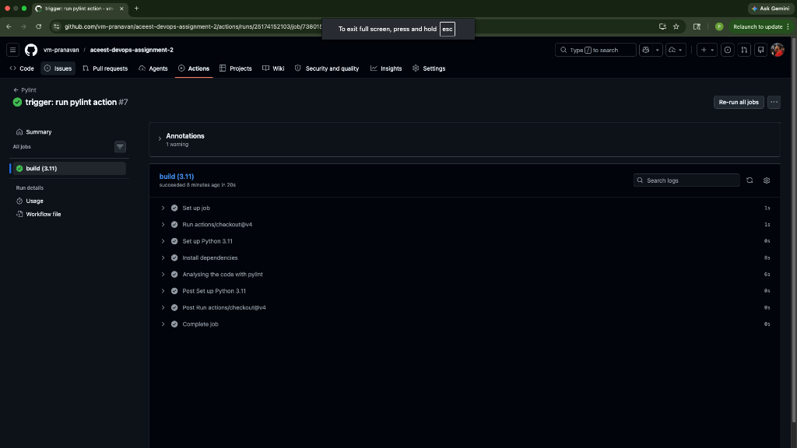

# ACEest Fitness & Gym - CI/CD Pipeline

This repository contains the completed DevOps Assignment 2. The project involves refactoring a legacy Tkinter desktop application into a modern Flask web application, containerizing it with Docker, and setting up an automated end-to-end CI/CD pipeline using Jenkins and Kubernetes (Minikube).

## Project Architecture

1. **Web Application**: Refactored stateless Python Flask app with an SQLite database (capable of utilizing external PVs in production).
2. **Containerization**: Packaged using a multi-stage `Dockerfile`.
3. **CI/CD Pipeline**: 8-stage Jenkins pipeline (`Jenkinsfile`) covering Checkout, Install Dependencies, Lint (Flake8), Unit Tests (Pytest), SonarQube Analysis, Build Image, Push to Docker Hub, and Deploy to Kubernetes.
4. **Code Quality**: GitHub Actions runs Pylint on every push to `main`.
5. **Deployment**: Kubernetes manifests configured for advanced deployment strategies (Rolling, Blue-Green, Canary, Shadow, A/B).

## Screenshots of Completion

### 1. Minikube Application Running
The containerized application successfully deployed and running locally via Minikube.

### 2. Jenkins CI/CD Dashboard
The full 8-stage Jenkins pipeline passing successfully with 100% test coverage.

### 3. SonarQube Code Quality Analysis
The SonarQube Quality Gate passing with 0 bugs, 0 vulnerabilities, and A-rating for maintainability.

### 4. GitHub Actions (Pylint)
The automated GitHub Actions workflow passing the Pylint code quality checks.

## Deployment Strategies
The `k8s/` directory contains configuration files for various deployment strategies:
- `rolling-update.yaml` (Default)
- `blue-green.yaml`
- `canary.yaml`
- `shadow.yaml`
- `ab-testing.yaml`

## Setup & Running

**Prerequisites**: Docker, Docker Compose, Minikube.

1. **Start Infrastructure**: Run `docker-compose up -d` to start the Jenkins and SonarQube containers locally.
2. **Start Minikube**: Run `minikube start --driver=docker`.
3. **Run Pipeline**: Commit code to `main` to trigger the CI/CD Jenkins pipeline which automatically deploys to Minikube.
4. **View App**: Run `minikube service aceest-fitness-service -n aceest-fitness` to view the live web application.
