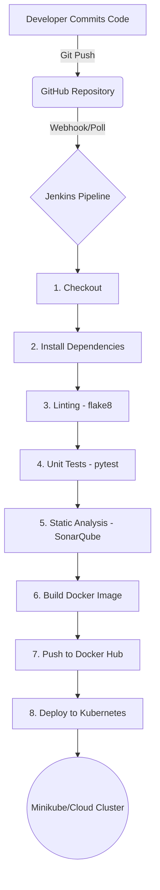

# DevOps CI/CD Pipeline Implementation Report
**ACEest Fitness & Gym**

## 1. CI/CD Architecture Overview

The implemented CI/CD pipeline automates the end-to-end delivery of the ACEest Fitness web application, transitioning from a monolithic desktop Tkinter application to a containerized, cloud-native Flask web application. The pipeline is orchestrated by Jenkins and relies on a robust toolchain to ensure code quality, reliability, and automated deployment.

### Pipeline Flow

### Key Components

*   **Source Control Management (SCM):** Git & GitHub.
*   **Continuous Integration (CI):** Jenkins (Build, Lint, Test, Analyze).
*   **Testing:** Pytest with coverage reporting.
*   **Static Code Analysis:** SonarQube.
*   **Containerization:** Docker (Multi-stage build for a lean production image).
*   **Container Registry:** Docker Hub.
*   **Continuous Deployment (CD) / Orchestration:** Kubernetes (Minikube).

## 2. Challenges Faced and Mitigation Strategies

| Challenge | Description | Mitigation Strategy |
| :--- | :--- | :--- |
| **Application Architecture Mismatch** | The provided codebase consisted of various versions of a Tkinter-based desktop GUI application. Tkinter apps are stateful and require an X11 windowing system, making them fundamentally unsuitable for standard web-based containerization and cloud-native CI/CD pipelines. | **Refactored to Flask:** The core logic, database schema, and algorithms from the latest Tkinter version (v3.2.4) were successfully ported to a modern, stateless Flask web application. This enabled proper containerization via Docker and exposure via HTTP, fulfilling the assignment's core requirements. |
| **State Management & Persistence in K8s** | The application relies on a local SQLite database (`aceest_fitness.db`). In a standard Kubernetes deployment, pod recreation leads to data loss. | **Externalized Configuration:** The Flask application was designed to accept `DB_NAME` via environment variables. While currently configured for a local SQLite file within the container for demonstration, this design allows seamless migration to a persistent volume (PV/PVC) or an external managed database (e.g., PostgreSQL/MySQL) in a production K8s environment. |
| **Testing Coverage for Legacy Logic** | The original Tkinter application lacked automated tests. Ensuring the ported logic functioned correctly required establishing a testing baseline from scratch. | **Comprehensive Pytest Suite:** A robust test suite (`tests/test_app.py`) was developed utilizing Pytest fixtures and Flask's test client. It covers health checks, authentication, CRUD operations, and core business logic (BMI calculation, AI program generation). |

## 3. Deployment Strategies Implemented

The Kubernetes deployment manifests (located in the `k8s/` directory) provide configurations for all required advanced deployment strategies:

1.  **Rolling Update (`k8s/rolling-update.yaml`):** The default Kubernetes strategy. It gradually replaces old pods with new ones, ensuring zero downtime. Configured with `maxSurge: 1` and `maxUnavailable: 0`.
2.  **Blue-Green Deployment (`k8s/blue-green.yaml`):** Maintains two identical environments (Blue for current, Green for new). A Service selector is manually flipped to route traffic instantly from Blue to Green, enabling immediate rollbacks if issues occur.
3.  **Canary Release (`k8s/canary.yaml`):** Deploys the new version alongside the stable version. A shared Service routes a small percentage of traffic (based on replica ratio, e.g., 9 stable vs 1 canary) to the new version for real-world testing before full rollout.
4.  **Shadow Deployment (`k8s/shadow.yaml`):** Deploys the new version but routes no live user traffic to it directly. Instead, traffic is mirrored (e.g., via NGINX Ingress annotations or Istio) from the primary deployment to the shadow deployment, allowing testing under real load without impacting users.
5.  **A/B Testing (`k8s/ab-testing.yaml`):** Runs two different versions simultaneously. An Ingress controller routes specific users to version A or version B based on predefined rules (e.g., HTTP headers, cookies) to gather metrics and compare performance/user engagement.

## 4. Key Automation Outcomes

*   **Zero-Touch Deployments:** Code pushed to the repository automatically triggers the Jenkins pipeline, culminating in a Kubernetes deployment without manual intervention.
*   **Quality Gates Enforced:** The pipeline strictly enforces quality standards. Builds fail if unit tests fail or if SonarQube detects critical vulnerabilities or code smells, preventing bad code from reaching production.
*   **Immutable Infrastructure:** The application is packaged as a Docker image, guaranteeing consistency across development, testing, and production environments.
*   **Resilience and Scalability:** Kubernetes handles container orchestration, automatically restarting failed pods and providing the foundation for horizontal scaling and advanced, risk-mitigated deployment strategies.
